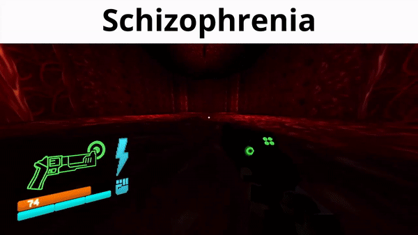

# bepis-decoder-ultrakill

> **A backup of the functional save file decoder for ULTRAKILL.**

This repository serves as a backup for a script used to decode and decrypt **ULTRAKILL** save files. Perfect for manual save file modifications, stat analysis, or just satisfying your braincells ig.

---

## Features 
* **Decode:** Transform encrypted save data into human-readable text.

## Instructions
1. **Backup your saves!** (Located in your Steam library under `ULTRAKILL/Saves`).
2. Clone this repository or download the script.
3. Run the decoder against your `.bepis` files.
4. Use a **Hex Editor** (like [HxD](https://mh-nexus.de/en/hxd/)) to open your save files. You can use the information spat out by the script as a map to find and modify the specific values or strings in the raw file.

> [!WARNING]
> **MACHINE, PROCEED WITH CAUTION.**
> > Modifying save files can lead to corruption or data loss. Always keep a backup of your original save files before running any scripts.

## Credits
This code was originally authored by **0x3C50**. 

* **Original Gist:** [40e0c95bd39545f4ba2c5066fb50173a](https://gist.github.com/0x3C50/40e0c95bd39545f4ba2c5066fb50173a)
* **Author Profile:** [0x3C50 on GitHub](https://github.com/0x3C50)

  

